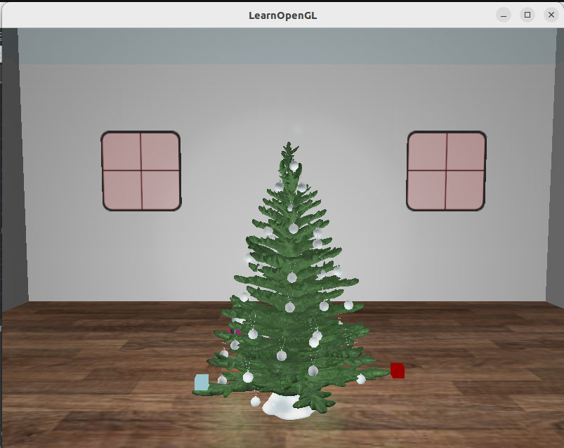
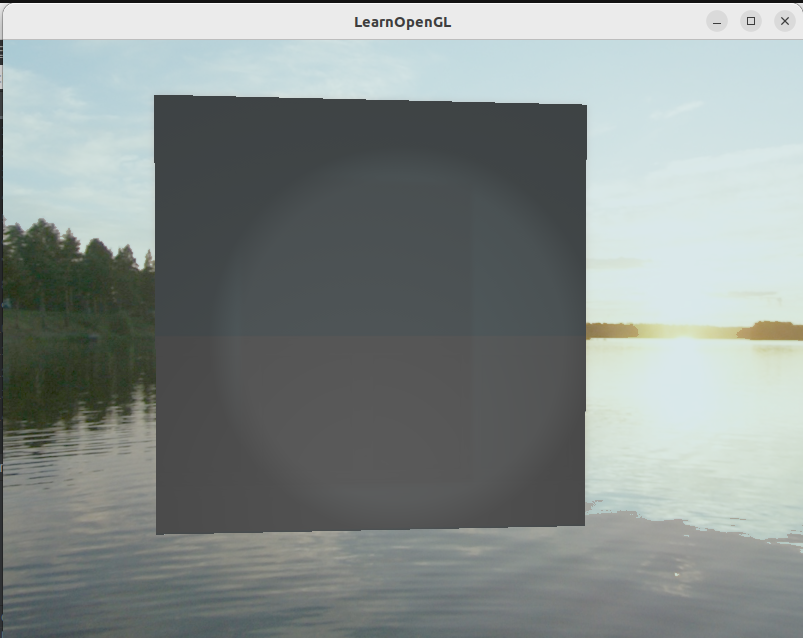

# Rotating Lights

A beautiful Christmas tree with multiple, color changing lights that rotate around it stays inside a cozy, dimly lit room.  
[Demo video](https://youtu.be/cVc-tuZsHj8)

# Keyboard instructions:

Moving: 
`W` - forwards

`S` - backwards

`A` - left

`D` - right
   
 
Ambient manipulation:

`Space` - turn on/off HDR

`B` - turn on/off bloom

`Q` - lower the exposure

`E` - raise the exposure

# Models used in the project

- [Christmas tree](https://free3d.com/3d-model/christmas-tree-v2--519851.html)
- [Windows](https://learnopengl.com/img/advanced/blending_transparent_window.png)

# Implemented fields

- Required:
   - [x] [Everything from week 1 to 8](https://www.youtube.com/playlist?list=PLD-fbfqEboxyzhQpaa_5SoNwKIOXoY5uj)
   - [x] [Blending, blend](https://learnopengl.com/Advanced-OpenGL/Blending)
   - [x] [Face culling](https://learnopengl.com/Advanced-OpenGL/Face-culling)
   - [x] [Advanced lighting](https://learnopengl.com/Advanced-Lighting/Advanced-Lighting)    
- Group A:
   - [x] [Cubemaps](https://learnopengl.com/Advanced-OpenGL/Cubemaps)    
- Group B:
   - [x] [HDR](https://learnopengl.com/Advanced-Lighting/HDR), [Bloom](https://learnopengl.com/Advanced-Lighting/Bloom)     

# Gallery

